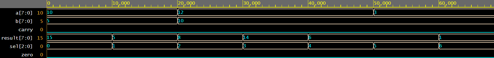
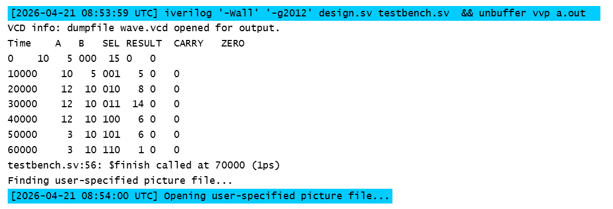

#  8-bit ALU Design in Verilog

## 📌 Overview

This project implements an 8-bit Arithmetic Logic Unit (ALU) using Verilog HDL. The ALU performs essential arithmetic and logical operations and is verified through simulation.

##  Features

* 8-bit inputs (A, B)
* 3-bit control signal (SEL)
* Operations:

  * Addition
  * Subtraction
  * AND
  * OR
  * XOR
  * Left Shift
  * Right Shift
* Carry and Zero flag support

## 🧠 Operation Table

| SEL | Operation |
| --- | --------- |
| 000 | A + B     |
| 001 | A - B     |
| 010 | A AND B   |
| 011 | A OR B    |
| 100 | A XOR B   |
| 101 | A << 1    |
| 110 | A >> 1    |

##  Design

The ALU is implemented using a combinational always block with a case statement to select operations.

## 🧪 Simulation Result
1. Webform

2.

##  How to Run (EDA Playground)

1. Go to EDA Playground
2. Select:

   * Language: Verilog
   * Simulator: Icarus Verilog
3. Copy `alu.v` → Design
4. Copy `alu_tb.v` → Testbench
5. Run simulation and open EPWave

##  Future Work

* Add overflow and negative flag
* Extend to 16-bit ALU
* Integrate into CPU design

##  Author

**Arman Hossain**
Electrical & Electronic Engineering
Interested in VLSI, AI Hardware, Semiconductor Design
